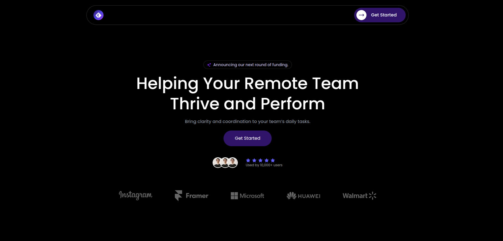
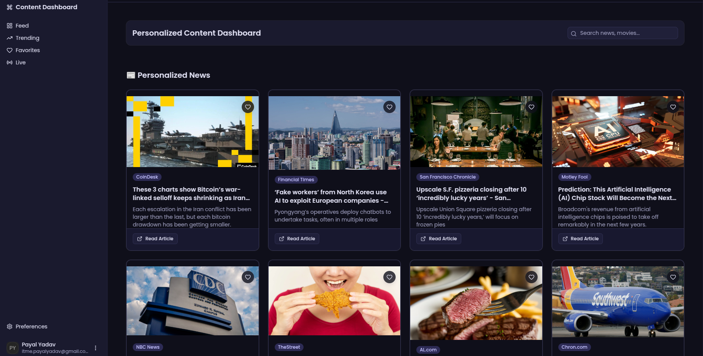

# 🚀 Personalized Content Dashboard

A **modern Personalized Content Dashboard** built with **Next.js, TypeScript, Redux Toolkit, and Tailwind CSS** that aggregates content from multiple sources into a **dynamic and customizable interface**.

Users can explore **news, recommendations, and social posts**, interact with content, save favorites, and receive **real-time updates** in a responsive and engaging dashboard.

---

# 🌐 Live Demo

🔗 [https://personalized-content-dashboard-818u.vercel.app](https://personalized-content-dashboard-818u.vercel.app)

---

# 📌 Features

### 🔥 Core Features

- Personalized content feed: news, movies/music, and social posts
- Real-time feed updates using **Server-Sent Events (SSE)**
- User authentication with **NextAuth.js** (GitHub login)
- User profile customization (avatar, username, preferences)
- Favorite / bookmark content
- Search functionality with **debounced input**
- Infinite scroll / pagination for large datasets
- Responsive dashboard layout with sidebar and top header
- Dynamic category filtering

### 🎨 UI & UX

- Smooth animations using **Framer Motion**
- Modern UI with **Tailwind CSS**
- Mobile responsive design
- Interactive content cards with hover effects
- Drag-and-drop reordering of content
- Dark mode toggle with persistent preference

### ⚡ Performance & Optimization

- Lazy loading of content and images
- Optimized API calls using Redux Toolkit + RTK Query
- Lighthouse-optimized scores for performance and accessibility

---

# 🖼️ Screenshots

### Landing Page



### Dashboard



---

# 🛠️ Tech Stack

### Frontend

- Next.js
- React
- TypeScript
- Tailwind CSS
- Framer Motion

### State Management

- Redux Toolkit
- Redux Persist

### Data & APIs

- NewsAPI for news
- TMDB / Spotify API for recommendations
- Mock/real Social API for posts
- Server-Sent Events (SSE) for real-time updates

### Authentication

- NextAuth.js (GitHub login)
- User profile customization

### Testing

- Jest + React Testing Library (unit & integration tests)
- Playwright / Cypress (E2E testing)

### Deployment

- Vercel

---

# ⚙️ Installation

### 1️⃣ Clone the Repository

```bash
git clone https://github.com/itmepayal/personalized-content-dashboard.git
```
