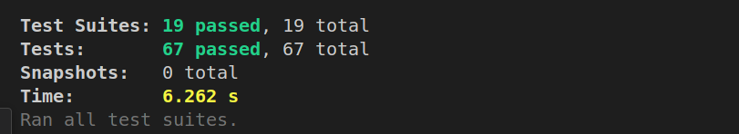

# 🚀 Personalized Content Dashboard

A **modern Personalized Content Dashboard** built with **Next.js, TypeScript, and Redux Toolkit** that aggregates content from multiple sources into a **dynamic and customizable user interface**.

Users can explore **news, recommendations, and social posts**, interact with content, save favorites, and receive **real-time updates** in a responsive and engaging dashboard.

---

# 🌐 Live Demo

🔗 https://personalized-content-dashboard-818u.vercel.app

---

# 📌 Features

### 🔥 Core Features

- Personalized content feed
- Real-time updates using **Server-Sent Events (SSE)**
- Favorite / bookmark content
- External article linking
- Responsive dashboard layout
- Dynamic category filtering

### 🎨 UI & UX

- Smooth animations using **Framer Motion**
- Modern UI with **Tailwind CSS**
- Mobile responsive design
- Interactive cards and hover effects

### ⚡ Performance

- Optimized images
- Lazy loading
- Lighthouse optimized

---

# 🖼️ Screenshots

### Landing Page


### Landing Page (Unit Testing and Integration Testing)



### Dashboard


### Dashboard (Unit Testing and Integration Testing)


---

# 🛠️ Tech Stack

### Frontend

- Next.js
- React
- TypeScript
- Tailwind CSS
- Framer Motion

### State Management

- Redux Toolkit

### Data & APIs

- REST APIs
- Server-Sent Events (SSE)

### Testing

- Jest
- React Testing Library

### Deployment

- Vercel

---

# ⚙️ Installation

## 1️⃣ Clone the Repository

```bash
git clone https://github.com/yourusername/personalized-content-dashboard.git
```

## 2️⃣ Navigate to Project Folder

```bash
cd personalized-content-dashboard
```

## 3️⃣ Install Dependencies

```bash
npm install
```

## 4️⃣ Run Development Server

```bash
npm run dev
```

Open your browser and go to:

```
http://localhost:3000
```

---

# 🔐 Environment Variables

Create a `.env.local` file in the root directory.

```
GITHUB_CLIENT_ID=your_client_id
GITHUB_CLIENT_SECRET=your_client_secret
CLIENT_URL=http://localhost:3000
```

---

# 🧪 Running Tests

Run Jest tests:

```bash
npm run test
```

---

# 📊 Performance

Lighthouse Report:

| Metric         | Score |
| -------------- | ----- |
| Performance    | 97    |
| Accessibility  | 99    |
| Best Practices | 90    |
| SEO            | 100   |

---

# 🔮 Future Improvements

- User authentication
- AI-powered content recommendations
- Drag-and-drop widgets
- Dark mode customization
- Content personalization algorithms

---

# 🤝 Contributing

Contributions are welcome!

1. Fork the repository
2. Create a new branch

```
git checkout -b feature-name
```

3. Commit your changes

```
git commit -m "Add new feature"
```

4. Push to your branch

```
git push origin feature-name
```

5. Create a Pull Request

---

# 📄 License

This project is licensed under the **MIT License**.

---

# 👨‍💻 Author

Developed by **Payal Yadav**

If you like this project, consider giving it a ⭐ on GitHub!
